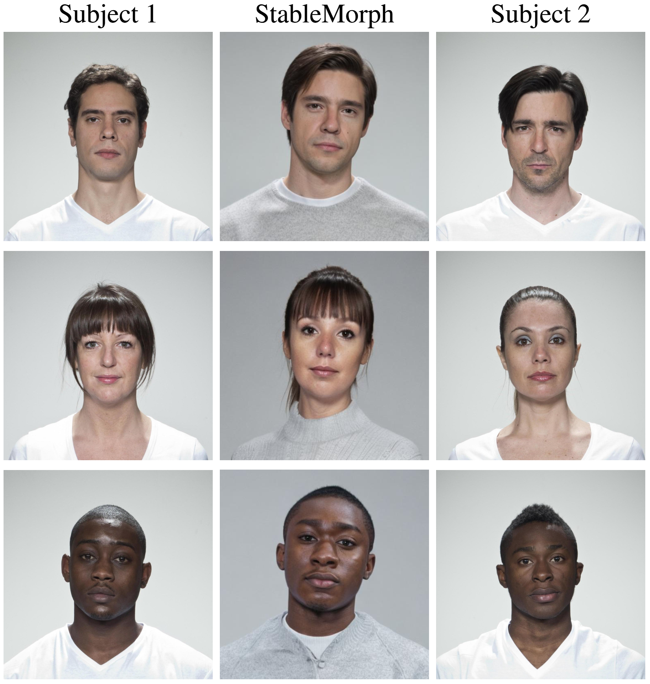

<!-- # StableMorph -->
<h1 align="center"> StableMorph: High-Quality Face Morph Generation with Stable Diffusion</h1>
<p align="center">

  <p align="center">
    <a href=""><strong>Wassim Kabbani</strong></a>
    ·
    <a href="https://www.ntnu.edu/employees/kiran.raja"><strong>Kiran Raja</strong></a>
    ·
    <a href="https://www.ntnu.edu/employees/raghavendra.ramachandra"><strong>Raghavendra Ramachandra</strong></a>
    ·
    <a href="https://dasec.h-da.de/staff/christoph-busch/"><strong>Christoph Busch</strong></a>

  </p>
  <h2 align="center">International Joint Conference on Biometrics 2025 </h2>
  <div align="center">
  </div>

Please contact Christoph Busch (christoph.busch@h-da.de) to receive the official code and pre-trained models.

<p align="center"> 

</p>

## Citation 

If you use this work in your publication, please cite the following publications:

```
@inproceedings{StableMorph:IJCB:2025,
      title = {{StableMorph}: High-Quality Face Morph Generation with Stable Diffusion},
      author={Wassim Kabbani and Kiran Raja and Raghavendra Ramachandra and Christoph Busch},
      year={2025},
      eprint={2511.08090},
      archivePrefix={arXiv},
      url={https://arxiv.org/abs/2511.08090}, 
}
```
As StableMorph is based on Stable Diffusion, please further cite:
```
@inproceedings{rombach2022highresolution,
      title={High-Resolution Image Synthesis with Latent Diffusion Models}, 
      author={Robin Rombach and Andreas Blattmann and Dominik Lorenz and Patrick Esser and Björn Ommer},
      year={2022},
      eprint={2112.10752},
      archivePrefix={arXiv}
}
```
